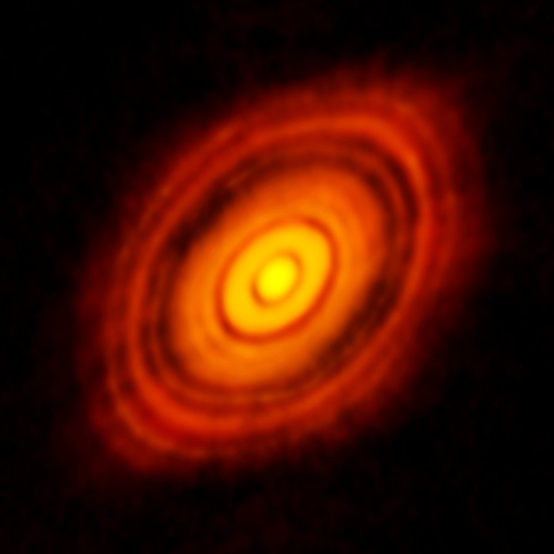

## Characterization of Young Accreting Planets

Eduard Bopp, Hubert Klahr (MPIA) & Sebastian Wolf (Uni Kiel)

Supported by DFG Priority Programme 1992

October 25th, 2017

Note:

This is an outlook, I do not have any results

---

### Planet formation

1. Gas and dust disk
2. ???
3. Planets!

Note:

Early stage – circumstellar disk

- Lots of observations
- Understanding of physical processes connected
  - Grain growth up to millimeter-sized particles

Late stage – mature planetary systems

- Possible structures
- Statistics
- Dynamical stability
- Put solar system in context

Specific aspect as mentioned in title:
Young planets, embedded in disks are somewhere in between
Still accreting material -> understand growth phase

---

### Observing embedded planets

Credit: ESO, NASA

Note:

Current and next-gen observatories will give us more data

- SPHERE/VLT
- METIS/E-ELT
- MIRI/JWST
- ALMA

Visible, IR, Millimeter

Direct detection of accreting planets?

---

### Study of embedded planets

Source: Ruge et al. (2014)

Note:

Should show features like

- Ring structures
- Spiral waves
- Horseshoe orbits
- Circumplanetary disk
- Accretion onto the planet

---

Credit: ALMA (ESO/NAOJ/NRAO)

---

### Interpreting observations

- *Dynamical model of planet-disk system*
- Detailed model of observed radiation (S. Wolf, Uni Kiel)

---

### Dynamical models of planet-disk system

- Internal energy of disk is dominated by radiation
- 3D radiation hydrodynamical numerical models

Note:

Treat radiation as accurately as possible in a dynamical setup

---

### Hydrodynamics

PLUTO for hydrodynamics (Mignone et al. 2007)

---

### Radiation treatment

- Approximate radiation model used within fluid simulations
- Flux-limited diffusion with frequency-dependent stellar irradiation
- See Kuiper et al. (2010), Flock et al. (2013), Kolb et al. (2013)

Note:

FLD: strong simplification of radiative transfer

fast, thus practical for dynamical simulations
but leads to inaccuracies for transition from optically thin to optically thick
parts of the disk

fix at least dominant stellar irradiation using frequency-dependent ray-tracing

---

### Further aspects to study

- Dust opacities (so far Ossenkopf & Henning, 1994)
- Accretion shock at planet (e.g. Marleau et al., 2017)
- Adaptive mesh refinement
- Photoionization for hot regions

Note:

AMR is very useful for this type of problem
Radiation treatment not implemented yet for AMR
Limited work in that direction by Szulágyi et al. (2017)

---

### Summary

- Dynamical models of planet-disk interaction
- Aim: treat radiation as accurately as possible
- Relevant to understand physical processes in circumplanetary disks

---

## Any interesting observation to model?

Note:

Theory needs to be guided by observations

If you need dynamical models for

---

### Thank you for your attention

Contact: bopp@mpia.de

For reference:

- Klahr & Kley (2006)
- Kley et al. (2009)
- Kuiper et al. (2010)
- Marleau et al. (2017)
