## Characterization of Young Accreting Planets

Japanese-German Meeting on Exoplanets & Planet Formation

September 27, 2018

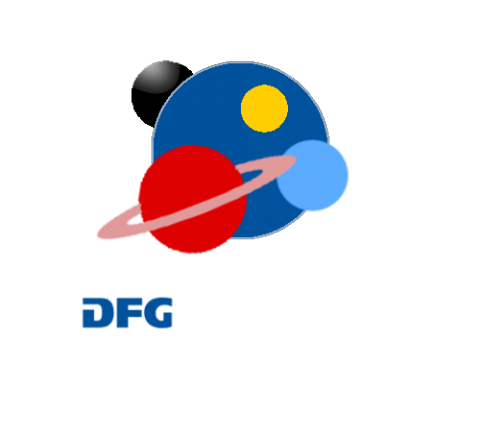

**Eduard Bopp**, Hubert Klahr (MPIA), Anton Krieger, Sebastian Wolf (Uni Kiel) & Rolf Kuiper (Uni Tübingen)

---

## Observing young planets

**LkCa 15**

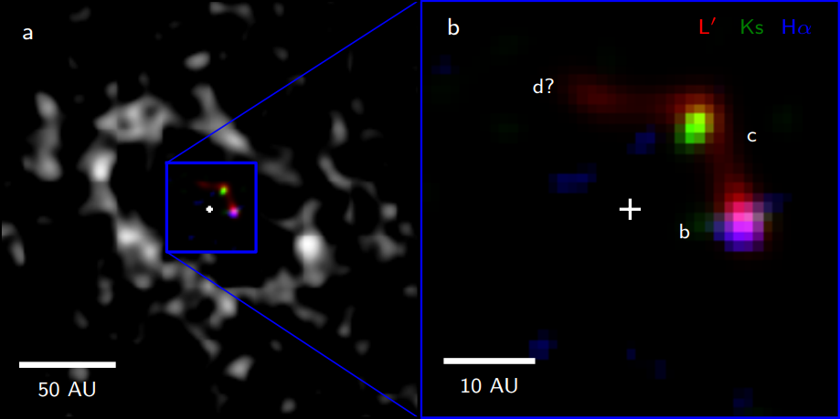

Sallum et al. (2015)

**HD 100546**

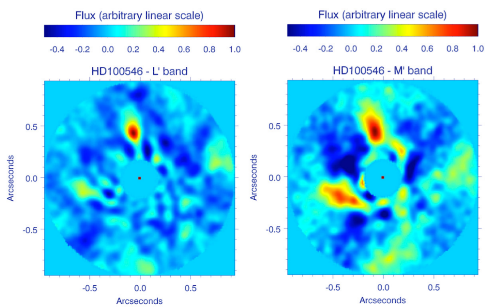

Quanz et al. (2015)

**PDS 70**

Keppler et al. (2018), Müller et al. (2018)

### More to come…

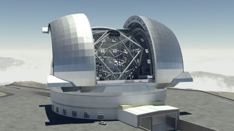

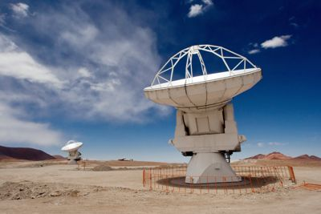

*Credit: ESO, NASA*

Note:

- SPHERE/VLT
- METIS/E-ELT
- MIRI/JWST
- ALMA

Visible, IR, Millimeter

Direct detection of accreting planets?

---

### Interpreting observations with models

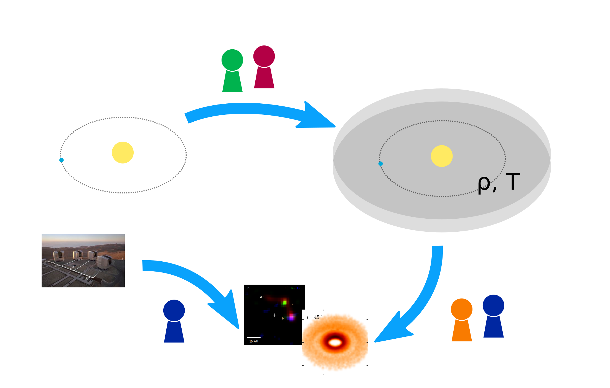

### Dynamical simulations

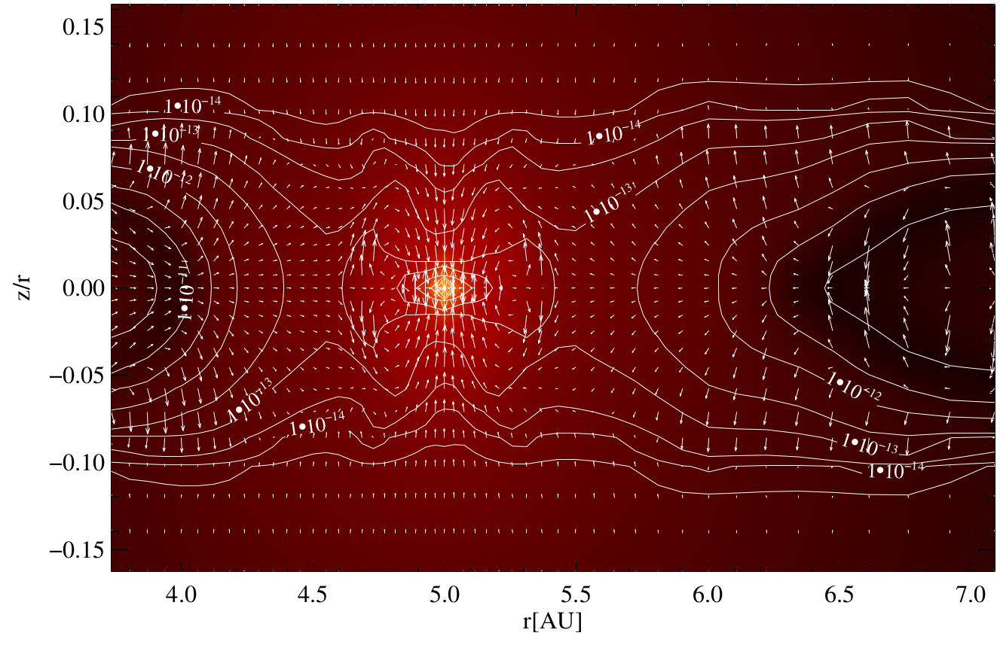

color: density, contours: temperature, arrows: velocity

from Klahr & Kley (2006)

### Synthetic observations

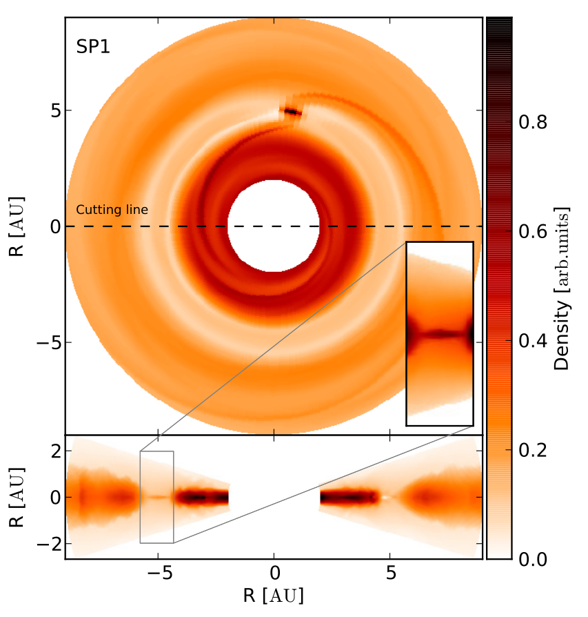
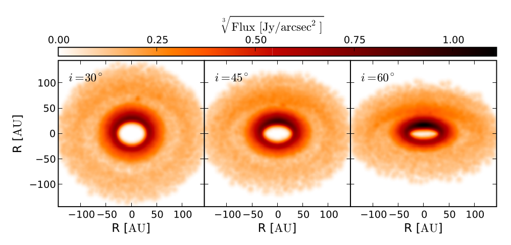

Source: Ruge, Wolf, Uribe & Klahr (2014)

Note:

Should show features like

- Accretion onto the planet
- Circumplanetary disk
- Horseshoe orbits
- Ring structures
- Spiral waves

Feasibility of detecting gaps (caused by planets) with ALMA

---

### Dynamical models

- Disk temperature is influenced by radiation
- For an accurate treatment, we need to handle radiation
- 3D radiation hydrodynamical numerical models using PLUTO (Mignone et al.,
  2007)

### Radiative transfer

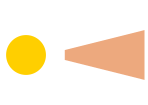

Note:

Approximate radiation model used within fluid simulations

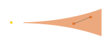

- Flux-limited diffusion (Levermore & Pomeraning, 1981)
- Implementation in PLUTO: Kuiper et al. (2010)
- Compare: Flock et al. (2013)

Note:

gray approximation

fast, thus practical for dynamical simulations

FLD is a strong simplification of radiative transfer

leads to inaccuracies in atmosphere: opt. thin -> opt. thick

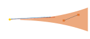

Frequency-dependent ray-tracing (Kuiper et al., 2010 & 2013)

Note:

stellar irradiation using frequency-dependent ray-tracing

refer to Flock et al. (2013) as alternative implementation

---

## Qualitative results

### Current setup

- Start with isothermal profile
- Let it settle in 2D axissymmetric simulation
- Run full 3D simulation
- Add a planet's gravitational potential

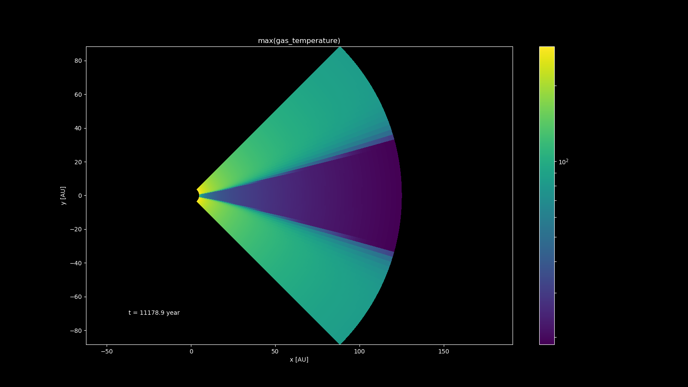

<video width="100%" controls autoplay loop>
  <source src="images/simulation/topdown-density-perturbation.ogg" type="video/ogg">
</video>

Relative density perturbation shows spiral waves

### Next

- 1:1 comparison to real systems (incl. post-processing)
- FLD does not capture shadows inside the disk
  - Test use of M1 closure (Voelkel et al., in prep.)
- Mesh refinement to improve resolution around planet

---

### Summary

- Dynamical models of planet-disk interaction
- Aim: treat radiation as accurately as possible
- Interpret observations of circumplanetary disks

**Contact:** bopp@mpia.de
