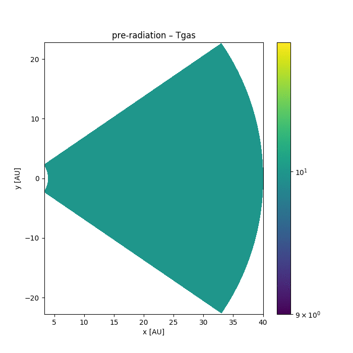
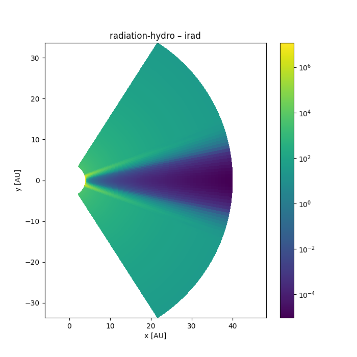

## Characterization of Young Accreting Planets

Eduard Bopp, Hubert Klahr (MPIA), Anton Krieger, Sebastian Wolf (Uni Kiel) & Rolf Kuiper (Uni Tübingen)

Supported by DFG Priority Programme 1992

MPIA/ITA Joint Retreat – March 8, 2018

---

### Observing embedded planets

Candidate around HD100546

$$
\mathrm{T} = 932^{+193}\_{-202} \mathrm{K}, \quad
\mathrm{R} = 6.9^{+2.7}\_{-2.9} \mathrm{R}\_\mathrm{Jup}
$$

Source: Quanz et al. (2015)

Note:

if real => object we are interested in

Credit: ESO, NASA

Note:

Current and next-gen observatories will give us more data

- SPHERE/VLT
- METIS/E-ELT
- MIRI/JWST
- ALMA

Visible, IR, Millimeter

Direct detection of accreting planets?

---

## Interpreting observations

- *Dynamical model of planet-disk system*
- Detailed model of observed radiation (Uni Kiel)
  - Radiative transfer models
  - Instrument effects

### Numerical models

Source: Klahr & Kley (2006)

Note:

disk thickens around planet, high pressure scale height
donut-shaped structure

### Synthetic observations

Source: Ruge, Wolf, Uribe, Klahr (2014)

Note:

Should show features like

- Accretion onto the planet
- Circumplanetary disk
- Horseshoe orbits
- Ring structures
- Spiral waves

Feasibility of detecting gaps (caused by planets) with ALMA

---

## Dynamical models

- Disk temperature is influenced by radiation
- 3D radiation hydrodynamical numerical models

Note:

Treat radiation as accurately as possible in a dynamical setup

### Hydrodynamics

PLUTO (Mignone et al. 2007)

- Godunov-type grid code
- Adaptive mesh refinement
- Many different physics modules

Note:

experience in group
availability of accurate radiation models

### Radiative transfer

Note:

Approximate radiation model used within fluid simulations

- Flux-limited diffusion: $ \mathbf{F} = - D ∇ E\_\mathrm{rad} $
- Levermore & Pomeraning (1981)
- Implementation in PLUTO: Kuiper et al. (2010)

Note:

gray approximation

fast, thus practical for dynamical simulations

FLD is a strong simplification of radiative transfer

leads to inaccuracies in atmosphere: opt. thin -> opt. thick

maybe M1 closure later?

Frequency-dependent ray-tracing (Kuiper et al., 2010 & 2013)

Note:

stellar irradiation using frequency-dependent ray-tracing

refer to Flock et al. (2013) as alternative implementation

---

### 2D axis-symmetric setup

- Start with disk in (approximate) hydrostatic equilibrium
- Calculate radiative equilibrium
- Run radiation-hydro simulation

<video controls height="600">
  <source src="images/density-evolution.ogg" type="video/ogg">
</video>

### Next steps

- Stabilize it (initial conditions too far from equilibrium)
- Move to 3D
- Add the planet
- Apply to real systems

### Further aspects to study

- Dust & gas opacities
- Accretion shock at planet (Marleau et al., 2017)
- Refinement of the region around the planet
- Ionization for hot regions

Note:

AMR is very useful for this type of problem

Radiation treatment not implemented yet for AMR

Some work in that direction by Szulágyi et al. (2017)

---

### Summary

- Dynamical models of planet-disk interaction
- Aim: treat radiation as accurately as possible
- Relevant to interpret observations of circumplanetary disks

---

### Thank you for your attention

Contact: bopp@mpia.de

For reference:

- Klahr & Kley (2006): *Initial radiation hydro model*
- Kuiper, Klahr, Dullemond, Kley, Henning (2010): *Frequency-dependent irradiation*
- Ruge, Wolf, Uribe, Klahr (2014): *Feasibility of detection with ALMA*
- Marleau, Klahr, Kuiper, Mordasini (2017): *Planetary accretion shock*
