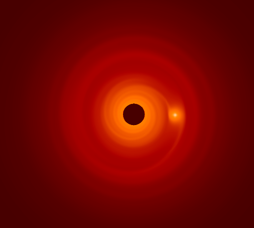
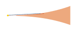
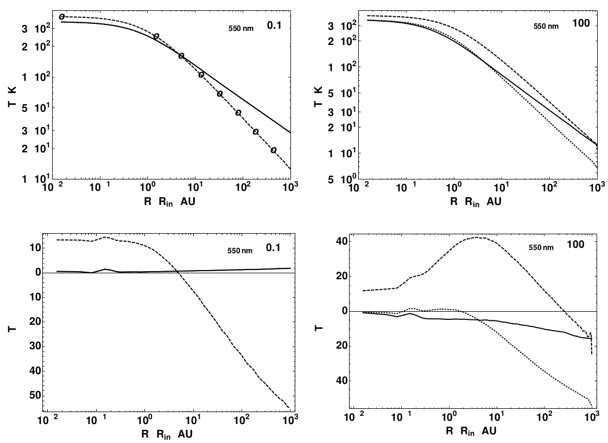

## Characterization of Young Accreting Planets

Eduard Bopp, Hubert Klahr (MPIA) & Sebastian Wolf (Uni Kiel)

Supported by DFG Priority Programme 1992

NumPDI, Cuernavaca, November 24th, 2017

Note:

Happy to present my research

More of an outlook, no results yet

Open to suggestions by all the experts

---

### Observing embedded planets

Candidate around HD100546

Source: Quanz et al. (2013)

Credit: ESO, NASA

Note:

Current and next-gen observatories will give us more data

- SPHERE/VLT
- METIS/E-ELT
- MIRI/JWST
- ALMA

Visible, IR, Millimeter

Direct detection of accreting planets?

---

### Schematic overview

Note:

- make a drawing here that shows the basic features
- talk about individual features
- make clear what the focus of this work is
- use this as a guideline to come back to?

### Numerical models

Source: Klahr & Kley (2006)

Note:

disk thickens around planet, high pressure scale height
donut-shaped structure

### Synthetic observations

Source: Ruge, Wolf, Uribe, Klahr (2014)

Note:

Should show features like

- Accretion onto the planet
- Circumplanetary disk
- Horseshoe orbits
- Ring structures
- Spiral waves

Feasibility of detecting gaps (caused by planets) with ALMA

### Interpreting observations

- *Dynamical model of planet-disk system*
- Detailed model of observed radiation (S. Wolf, Uni Kiel)
  - Radiative transfer models
  - Instrument effects

---

### Dynamical models of planet-disk system

- Internal energy of disk is dominated by radiation
- 3D radiation hydrodynamical numerical models

Note:

Treat radiation as accurately as possible in a dynamical setup

### Hydrodynamics

PLUTO for hydrodynamics (Mignone et al. 2007)

Note:

experience in group
availability of accurate radiation models

### Radiative transfer

Note:

Approximate radiation model used within fluid simulations

- Flux-limited diffusion (Kuiper et al., 2010)
- Improve to M1 closure later

Note:

FLD is a strong simplification of radiative transfer

fast, thus practical for dynamical simulations
but leads to inaccuracies for transition from optically thin to optically thick
parts of the disk

gray approximation

Frequency-dependent ray-tracing (Kuiper et al., 2010 & 2013)

Note:

stellar irradiation using frequency-dependent ray-tracing

refer to Flock et al. (2013) as alternative implementation

Kuiper & Klessen (2013)

Note:

Flux-limited diffusion not sufficient on its own

caveat not even this is accurate for intermediate optical depths around 10^3

---

### Current state

- 2D axis-symmetric radiation hydro setup
- Next steps: move to 3D, introduce the planet
- Collaboration on modelling real systems

### Further aspects to take into account

- Dust opacities
- Gas opacities (Malygin, Kuiper, Klahr, Dullemond, Henning; 2014)
- Accretion shock at planet (Marleau, Klahr, Kuiper, Mordasini; 2017)
- Adaptive mesh refinement
- Ionization for hot regions

Note:

AMR is very useful for this type of problem
Radiation treatment not implemented yet for AMR
Limited work in that direction by Szulágyi et al. (2017)

## Any interesting observation to model?

Note:

Theory needs to be guided by observations

Need dynamical models -> talk to me

---

### Summary

- Dynamical models of planet-disk interaction
- Focus on small-scale structures
- Aim: treat radiation as accurately as possible
- Relevant to understand physical processes in circumplanetary disks

---

### Thank you for your attention

Contact: bopp@mpia.de

For reference:

- Klahr & Kley (2006): *Initial radiation hydro model*
- Kuiper, Klahr, Dullemond, Kley, Henning (2010): *Frequency-dependent irradiation*
- Ruge, Wolf, Uribe, Klahr (2014): *Feasibility of detection with ALMA*
- Marleau, Klahr, Kuiper, Mordasini (2017): *Planetary accretion shock*
