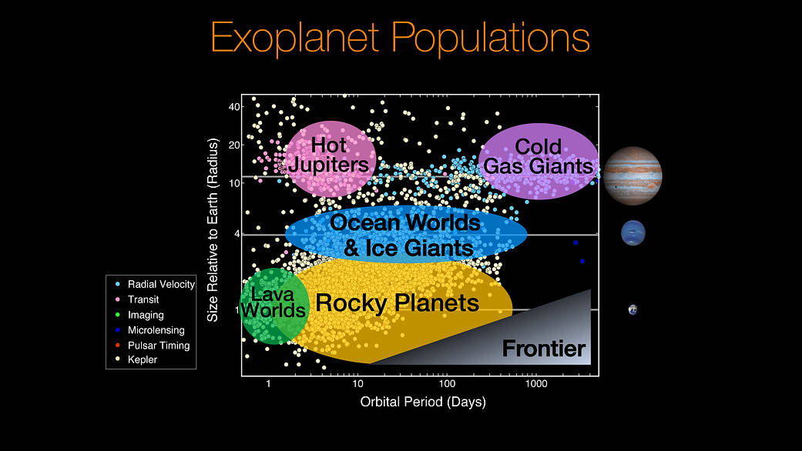

## Characterization of Young Accreting Planets

Eduard Bopp, Hubert Klahr (MPIA) & Sebastian Wolf (Uni Kiel)

Supported by DFG Priority Programme 1992

October 25th, 2017

---

### Intermediate stage of planet formation

→

How to fill the gap?

Note:

- Observations of circumstellar disks
- Good understanding of physical processes (What processes?)

- Mature planetary systems
- Statistics
- Dynamical stability
- Put solar system in context

---

### Observing embedded planets

Credit: ESO, NASA

Note:

Do not mention all the observatories explicitly

- SPHERE/VLT
- METIS/E-ELT
- MIRI/JWST
- ALMA

Visible, IR, Millimeter

---

### Study of embedded planets

Source: Ruge et al. (2014)

Note:

Should show features like

- Ring structures
- Spiral waves
- Horseshoe orbits
- Circumplanetary disk
- Accretion onto the planet

---

Schematic picture

- planet + disk structure + star
- observer

---

Credit: ALMA (ESO/NAOJ/NRAO)

---

### Interpreting observations

- *Dynamical model of planet-disk system*
- Detailed model of observed radiation (S. Wolf, Uni Kiel)

---

### Dynamical models of planet-disk system

- Internal energy of disk is dominated by radiation
- 3D radiation hydrodynamical numerical models

---

### Hydrodynamics

PLUTO for hydrodynamics (Mignone et al. 2007)

---

### Radiation treatment

- Approximate radiation model used within fluid simulations
- Flux-limited diffusion with frequency-dependent stellar irradiation (developed
  by Kuiper et al., 2010; Flock et al., 2013; Kolb et al., 2013)

---

### Current state?

---

### Further aspects

- Dust opacities (so far Ossenkopf & Henning, 1994)
- Accretion shock at planet (e.g. Marleau et al., 2017)
- Photoionization for hot regions
- Adaptive mesh refinement

---

### Summary

- Dynamical models of planet-disk interaction
- Relevant to understand physical processes in circumplanetary disks

---

### Thank you for your attention

Relevant literature:

- Klahr & Kley (2006)
- Kley et al. (2009)
- Kuiper et al. (2010)
- Marleau et al. (2017)
