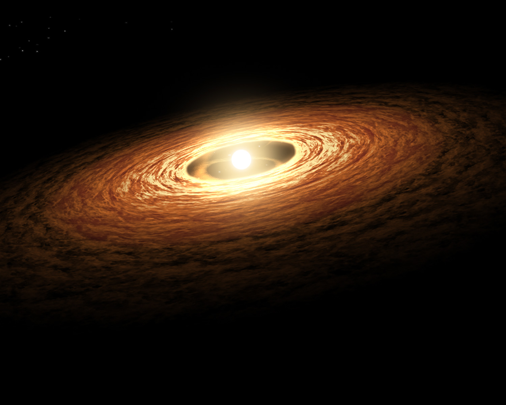

## Characterization of Young Accreting Planets

Eduard Bopp

October 25th, 2017

---

### Planet formation: early stage

Note:

- Observations of circumstellar disks
- Good understanding of physical processes

What processes?

---

### Planet formation: late stage

Note:

- Mature planetary systems
- Catalogue of detected extrasolar planets
- Puts solar system into perspective

---

### What happens in between?

Note:

Add transition diagram

---

### Study of embedded planets

Source: Ruge et al. (2014)

Note:

Should show features like

- Ring structures
- Spiral waves
- Horseshoe orbits
- Circumplanetary disk
- Accretion onto the planet

---

### Observing embedded planets

Credit: ESO, NASA

Note:

- SPHERE/VLT
- METIS/E-ELT
- MIRI/JWST
- ALMA

---

### Derive physical properties

- Mass
- Effective temperature
- Luminosity
- Spectrum

---

## Project outlook

---

### Dynamical models of planet-disk interaction

- Radiation plays a role for hydrodynamical evolution
- Thus, 3D radiation hydrodynamical numerical models
- From this, create synthetic observations and compare to reality (partner project)

---

### Hydrodynamics

PLUTO for hydrodynamics (Mignone et al. 2007)

---

### Radiation treatment

- Grey approximation for internal radiation
- Flux-limited diffusion (extend to M1)
- Frequency-dependent irradiation from stellar source

Developed by Kuiper et al. (2010), Flock et al. (2013), Kolb et al. (2013)

---

### Further aspects

- Dust opacities
- Accretion shock at planet
- Photoionization
- Adaptive mesh refinement

---

## Conclusion

Any interesting observations to model?
